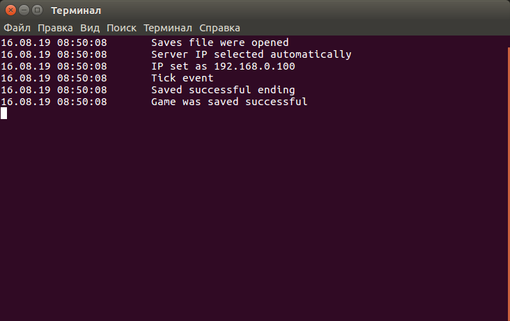

# Isometric

*Working server in ubuntu terminal*

Online strategy creating by C# and Unity3D. Repository includes game core, simple realization, server, server console and DLL with common for server and client classes and structures.

 * [Wiki] (https://github.com/girvel/Isometric/wiki)

## Used libraries:

 * [Command Interface] (https://github.com/girvel/CommandInterface)
 * [Custom Property] (https://github.com/girvel/CustomProperty)
 * [Visual Console] (https://github.com/girvel/VisualConsole)
 * [C# Tools] (https://github.com/girvel/CsTools)
